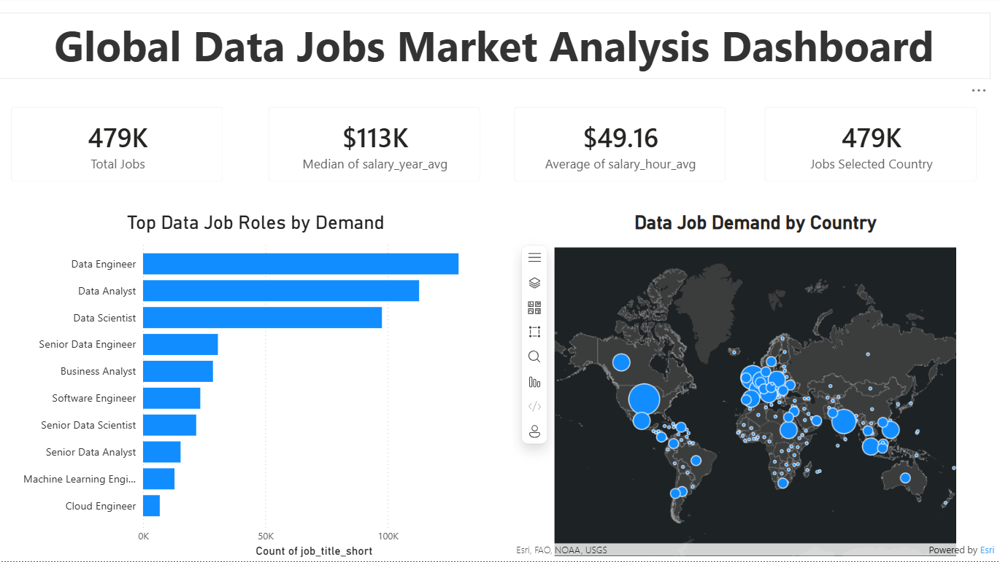

# 🌍 Global Data Jobs Market Analysis Dashboard

## 📊 Overview
This Power BI dashboard analyzes global demand for data jobs, salary trends, and geographic distribution of job opportunities.

## 🚀 Features
- Top data job roles by demand
- Global job distribution map
- Salary insights (median & average)
- Interactive filtering by country

## 🛠️ Tools Used
- Power BI
- DAX
- Excel

## 📈 Key Insights
- Data Engineer is the most in-demand role
- Job opportunities are concentrated in North America & Europe
- Salaries vary significantly across countries

## ⚠️ Note
Dataset is not included due to GitHub size limitations.

## 🔄 Status
🚧 Work in progress — more improvements coming

## 📸 Dashboard Preview
